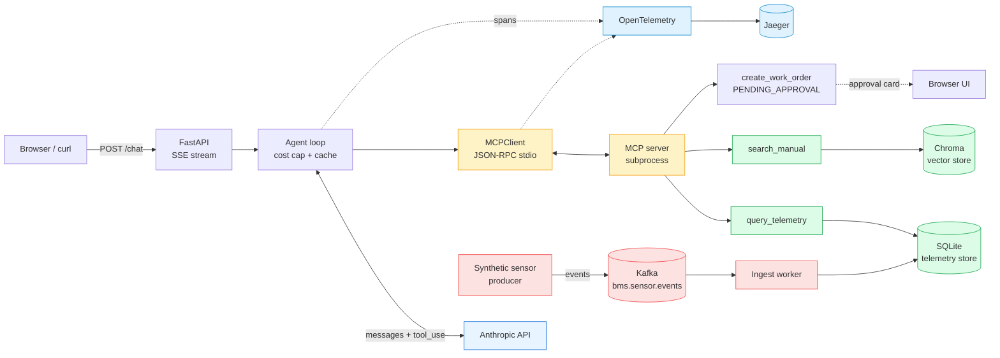

# applied-ai-lab

A working notebook for senior-backend-engineer-meets-applied-AI: production-shaped patterns for LLM apps, RAG, MCP, and agentic systems. Code-first, diagrams where they help, every component defensible under interview probing.

> **Status:** the build is complete through Phase 4 (capstone). Phase 5 (mock interview drill + resume cleanup) is the final layer.

---

## Why this repo exists

Most "AI engineering" content is one of two extremes — Hello-World notebooks that don't survive contact with production, or framework demos (`pip install langchain`) that hide the mechanics. This repo sits in the middle:

- **Built from primitives first** — raw HTTP / official SDK / hand-written loops — *then* shows what a framework would add
- **Defensible under interview probing** — every component has a "how does this actually work?" doc next to it
- **Architecture-aware** — chunking strategies, retrieval eval, agent loops, observability, failure modes
- **Reused, not invented** — the same pieces (Kafka, microservices, OTel) you'd use for non-AI distributed systems, applied here

## Repo map

| Path | What lives here |
|---|---|
| `docs/00-interview-prep/` | JD decode, STAR stories, 60-sec pitch, behavioral bank |
| `docs/01-concepts/` | Six architecture-depth explainers w/ Mermaid diagrams (LLM internals, embeddings, RAG, agent loop, MCP, observability) |
| `src/01-llm-basics/` | Plain LLM call → streaming → tool_use atom. Understand the request/response shape. |
| `src/02-rag/` | RAG pipeline from scratch + **eval harness** w/ Recall@k, MRR. Real numbers. |
| `src/03-agent/` | Tool-using agent loop + **hand-rolled MCP server** (raw JSON-RPC over stdio) + agent that uses MCP as tool transport |
| `src/04-capstone/` | **Building Ops Assistant** — FastAPI + agent + MCP + RAG + Kafka ingest + OpenTelemetry → Jaeger, all in docker-compose |

## The capstone — Building Ops Assistant

A production-shaped agent that mirrors real enterprise-AI architecture:



**Eight production-shaping decisions you can defend** (see [`src/04-capstone/README.md`](src/04-capstone/README.md)):

1. Event-driven ingest (Kafka → ingest worker → time-series store)
2. RAG over domain documents w/ grounded prompting + citation validation
3. **Hand-rolled MCP server** so the protocol is something you've implemented, not configured
4. Agent loop w/ `MAX_ITERS`, tool-errors-as-data, parallel tool use
5. Approval gate on side-effecting tools (`create_work_order` → PENDING_APPROVAL)
6. Prompt caching on stable system + tool schemas (~10% cost on cache reads)
7. Per-request cost cap with structured abort
8. OpenTelemetry GenAI semantic conventions on every LLM + tool call, viewable in Jaeger

## Quick start

```bash
# clone
git clone https://github.com/XKushal/applied-ai-lab.git
cd applied-ai-lab

# secrets
cp .env.example .env  # add your ANTHROPIC_API_KEY

# install (uv handles venv + deps)
curl -LsSf https://astral.sh/uv/install.sh | sh
uv sync

# ingest the RAG corpus once
uv run python src/02-rag/01_ingest.py

# the fast path: local API + UI, spans to console
cd src/04-capstone
uv run uvicorn app.main:app --reload --host 0.0.0.0 --port 8000
# → http://localhost:8000 in your browser

# OR the full path: docker-compose with Kafka + Jaeger
cd src/04-capstone/docker
docker compose up --build
# → http://localhost:8000 for UI, http://localhost:16686 for Jaeger
```

## Phases & status

- [x] **Phase 0** — Setup, scaffolding, README
- [x] **Phase 1** — JD decode + 7 STAR stories + 60-sec pitch
- [x] **Phase 2** — 6 concept docs w/ Mermaid + interview-probe sections
- [x] **Phase 3** — Hands-on builds (LLM → RAG w/ eval → tool-using agent → hand-rolled MCP)
- [x] **Phase 4** — Capstone: Building Ops Assistant (3 sessions, fully dockerized)
- [x] **Phase 5** — Mock-interview drill + resume bullet rewrites

---

Built by [Kushal Singh](https://github.com/XKushal) — senior backend / distributed systems / applied AI.
