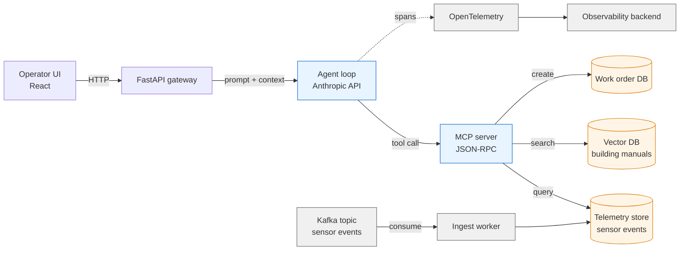

# applied-ai-lab

A working notebook for senior-backend-engineer-meets-applied-AI: production-shaped patterns for LLM apps, RAG, MCP, and agentic systems. Code-first, diagrams where they help.

> **Status:** active build-out. Each top-level folder maps to a phase; phases land as small, defensible commits — not framework wrappers, not toy chatbots.

---

## Why this repo exists

Most "AI engineering" content is one of two extremes — Hello-World notebooks that don't survive contact with production, or framework demos (`pip install langchain`) that hide the mechanics. This repo sits in the middle:

- **Built from primitives first** — raw HTTP / official SDK / hand-written loops — *then* shows what a framework would add on top
- **Defensible under interview probing** — every component has a "how does this actually work?" doc next to it
- **Architecture-aware** — chunking strategies, retrieval evaluation, agent loops, observability, failure modes
- **Reused, not invented** — the same pieces (Kafka-style event flow, microservices, OTel tracing) you'd use for non-AI distributed systems, applied here

## Repo map

| Path | What lives here |
|---|---|
| `docs/00-interview-prep/` | JD decode, STAR stories, 60-sec pitch, behavioral bank |
| `docs/01-concepts/` | Architecture-depth explainers + Mermaid diagrams (LLM internals, embeddings, RAG, agent loop, MCP, tool-use, observability) |
| `docs/99-mock-interview/` | Likely-question bank with model answers + whiteboard sketches |
| `src/01-llm-basics/` | Plain LLM call. No framework. ~30 lines. Understand the request/response shape. |
| `src/02-rag/` | RAG pipeline: chunk → embed → store → retrieve → rerank → generate. With eval harness. |
| `src/03-agent/` | Tool-using agent loop, hand-written. Then the same thing with a framework, side-by-side. |
| `src/04-capstone/` | The flagship build — see below |

## The capstone — Telemetry-Aware Ops Assistant

A production-shaped agent that mirrors real enterprise AI shape:



**What it demonstrates in an interview:**
- Event-driven ingest (Kafka) — same shape as Kaiser's DXP, applied to building-sensor telemetry
- RAG over domain documents (manuals)
- **A hand-rolled MCP server**, so you can answer "how does MCP actually work?" with code, not hand-waving
- An agent loop with retries, tool-use, and OpenTelemetry tracing
- All containerized with Docker, ready for K8s

## Local setup (one-time)

```bash
# already installed via Phase 0:
brew install poppler gh
curl -LsSf https://astral.sh/uv/install.sh | sh

# project setup
cd applied-ai-lab
uv venv && source .venv/bin/activate
uv pip install -r requirements.txt   # added once we hit Phase 3

# secrets
cp .env.example .env
# add your ANTHROPIC_API_KEY
```

## Phases & status

- [x] **Phase 0** — Setup, scaffolding, this README
- [ ] **Phase 1** — JD decode + STAR stories
- [ ] **Phase 2** — Concept docs + Mermaid diagrams
- [ ] **Phase 3** — Hands-on builds (LLM → RAG → Agent)
- [ ] **Phase 4** — Capstone: Telemetry-Aware Ops Assistant
- [ ] **Phase 5** — Mock-interview drill

---

Built by [Kushal Singh](https://github.com/) — senior backend / distributed systems / applied AI.
