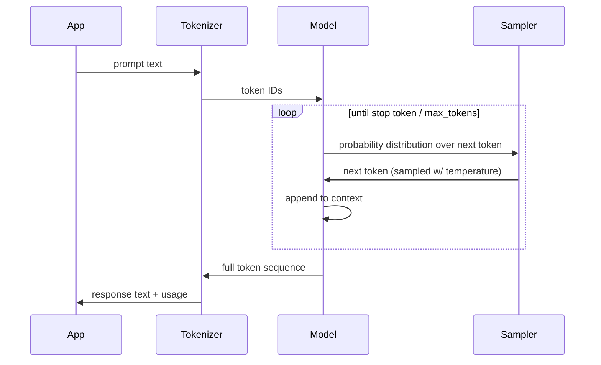

# LLM mental model — what it really is, what it really isn't

A senior engineer's working model of an LLM. Not "it's magic AI" — the actual mechanics, the parts that matter for production decisions.

---

## One-line definition

An LLM is a **function** that takes a sequence of tokens in and produces a probability distribution over the next token. Repeated generation = sampling from that distribution one token at a time. Everything else — chat, tools, RAG, agents — is plumbing around that core function.

---

## The four mechanics that affect every production decision

### 1. Tokens, not words

The model doesn't see words; it sees **tokens** (sub-word units). "Johnson Controls" ≈ 4 tokens. A page of dense prose ≈ ~500 tokens. Numbers and uncommon strings tokenize badly — `"FN2XCFP4RY"` (your laptop serial) may be 8+ tokens.

**Why you care:**
- Pricing and latency are per-token, not per-word.
- Context windows are token-limited (Claude Sonnet 4.6: 200K tokens ≈ 150K words).
- Bad tokenization (lots of code, lots of digits) eats your budget faster than expected.

### 2. Context window = the model's only memory

The model has **no memory between requests** beyond what you put in the context window. Every "remembered" fact in a chat is being **re-sent on every turn**. Conversation history grows linearly; you pay for it every time.

**Why you care:**
- "Memory" in an agent is a software pattern (write to a store, retrieve on next turn) — *not* a model feature.
- Long contexts → high cost, slower TTFT (time to first token), and degraded accuracy past a certain length (the "lost in the middle" effect).

### 3. Sampling — temperature, top-p, and determinism

The model outputs a probability distribution. **How** you pick the next token is a knob:
- **temperature** — higher = flatter distribution = more diverse output. `temperature=0` is the closest you get to "deterministic" (still not bit-exact across calls).
- **top-p / top-k** — truncate the distribution before sampling, prevents long-tail nonsense.

**Why you care:**
- Tool-use / structured output / RAG answers → low temperature (0–0.3). You want *consistency*, not creativity.
- Brainstorming, marketing copy → higher temperature (0.7–1.0).
- "Why does the model say different things on identical prompts?" → it's sampling. Set temperature lower.

### 4. The model has no idea what's true

It has **statistical patterns over its training data**. It does not retrieve facts, it generates *plausible* sequences. When the pattern matches reality, output is correct. When it doesn't, output is **hallucination** — fluent, confident, wrong.

**Why you care:**
- Anything factual, domain-specific, or post-training-cutoff → ground with RAG or tool calls.
- Even with RAG, the model can ignore the retrieved context if the question pulls hard against it. This is why retrieval evaluation matters.

---

## Diagram — the actual request flow

The loop is the whole show. Streaming = exposing that loop to the client one token at a time. Stopping = first stop sequence or hitting max_tokens.

---

## When an LLM is the *wrong* tool

A senior signal worth internalizing — knowing when *not* to reach for an LLM.

| Problem | Better tool |
|---|---|
| Deterministic computation (sum a column, regex parse) | Just write code |
| Numerical precision, money, anything regulatory-audited | DB query or rules engine |
| Exact lookup in a known schema | SQL, not RAG |
| Low-latency hot path (<50ms) | Cache or precomputed result; LLM TTFT alone is hundreds of ms |
| High-throughput, identical inputs | Cache the LLM's output — don't re-spend tokens |
| Anything where being wrong is unrecoverable | Don't put the LLM in the critical path; use it for *suggestion*, not *action*, behind a human approval |

---

## Questions worth being able to answer

- **"Why is the answer different each time I ask the same question?"** → sampling + temperature.
- **"How do you keep cost under control?"** → token accounting, prompt caching, smaller models for simple tasks, capping max_tokens, cache identical inputs.
- **"How would you handle hallucinations in a building-ops bot?"** → grounding via RAG or tool calls, refuse-when-unsure prompting, citation requirements, human-in-the-loop for actions, output validation against schemas.
- **"When would you *not* use an LLM?"** → the table above. Being able to say "I'd use SQL here, not RAG" reads as far more senior than reaching for an LLM every time.
- **"What's a context window and why does it matter at scale?"** → token-limited memory, cost is linear in tokens, accuracy degrades past a length even when it fits.
