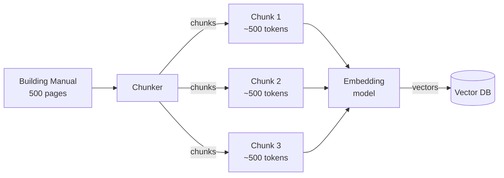
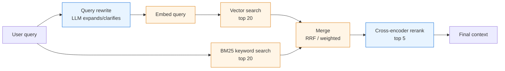

# Embeddings + retrieval — the building block under RAG

Before we talk about RAG, you need a working model of **embeddings** (turning text into numbers that capture meaning) and **retrieval** (finding the right pieces of text fast). These are independent of LLMs entirely — they're information retrieval, repackaged for the AI era.

---

## What an embedding actually is

An embedding model takes a string and outputs a fixed-length vector of floats — typically 256, 768, 1024, or 1536 dimensions.

```
"HVAC compressor fault code E47"  →  [0.013, -0.211, 0.084, ..., 0.072]  (1024 floats)
```

The vector is meaningless on its own. The **interesting property** is geometric: strings with similar *meaning* land near each other in vector space. **Cosine similarity** between two vectors → a number in [-1, 1] that approximates "how semantically close are these two pieces of text."

So `"compressor not cooling"` and `"AC unit warm air"` produce vectors with high cosine similarity even though they share no words. *That* is what makes semantic search possible.

---

## Embedding model choices in 2026

| Model | Dimensions | Notes |
|---|---|---|
| `voyage-3-large` (Anthropic's preferred) | 1024 | Strong default for English + code; supports 32K context |
| `text-embedding-3-small` (OpenAI) | 1536 (truncatable) | Cheap, fast, good enough for most use cases |
| `text-embedding-3-large` (OpenAI) | 3072 | Better quality, costlier |
| `nomic-embed-text` (open, via Ollama) | 768 | Local, free, good for prototyping; weaker on domain-specific |

**Senior choice criteria:** match the embedding model to your **corpus domain**. A general model on technical manuals is fine; on legal text or non-English, you'll need a domain-specific model.

> **Hard rule:** you cannot mix embeddings from different models in the same index. They live in different vector spaces — cosine similarity becomes meaningless across them. If you swap models, you re-embed the whole corpus.

---

## Vector databases — the storage layer

A vector DB stores embeddings + metadata and answers "give me the top-k vectors closest to this query vector" in milliseconds, even over millions of vectors. It does this via **Approximate Nearest Neighbor (ANN)** indexes — HNSW, IVF, etc. — which trade exact correctness for speed.

| Option | Sweet spot |
|---|---|
| **Chroma** | Embedded, zero-ops, perfect for dev / prototypes |
| **Qdrant** | Open-source, production-ready, great filtering |
| **pgvector** (Postgres extension) | "I already have Postgres" → use this |
| **Weaviate, Pinecone, Milvus** | Managed scale, $$$ |
| **Elasticsearch / OpenSearch** | If you need vector + full-text in one box |

For this lab we'll use **Chroma** in dev and discuss the pgvector pattern (the natural choice for any shop that already runs Postgres/SQL).

---

## Chunking — the part everyone underrates

You don't embed whole documents. You **chunk** them into pieces small enough to be retrieved precisely.



### Chunking strategies (worst → best for typical docs)

1. **Fixed-size character split** — naïve. Splits mid-sentence, kills semantic coherence. Don't use in production.
2. **Fixed-size token split with overlap** — better. Stride ~100 tokens of overlap so meaning isn't lost at boundaries.
3. **Recursive splitter (sentence/paragraph aware)** — splits on `\n\n` first, then `\n`, then sentence, then character. Preserves structure. **Solid default.**
4. **Structure-aware (markdown headings, code blocks)** — for technical docs with hierarchy. Chunk = section, with the heading path prepended to every chunk so the retriever has context.
5. **Semantic chunking** — group sentences by embedding similarity. Best quality, slowest to build. Use when retrieval quality is critical and corpus is small.

**Chunk size trade-off:** smaller chunks = more precise retrieval but less context per hit. Larger chunks = more context but the model has to wade through irrelevant text. Sweet spot for most use cases: **400–800 tokens with 50–100 token overlap.**

---

## Retrieval — beyond top-k cosine

Naïve retrieval = "embed the query, cosine-search the index, return top 5". Production retrieval has more steps.



### Each box, why it exists

- **Query rewrite** — users type messy short queries. An LLM expands "compressor noise" → "HVAC compressor making abnormal noise, possible bearing failure or refrigerant issue". Better signal for the embedder.
- **Hybrid search (vector + BM25)** — vector search catches *meaning*; BM25 catches *exact terms* (model numbers, error codes, proper names). The union is more robust than either alone. **RRF (Reciprocal Rank Fusion)** merges the two ranked lists.
- **Reranker** — a smaller cross-encoder model (Cohere Rerank, BGE reranker) that scores each (query, chunk) pair *together* — much more accurate than bi-encoder cosine, but only practical on a small set, which is why you do it last on the top 20.

You don't need all of these on day one. **Naïve top-k vector search** is a fine starting point. You add steps when retrieval evaluation tells you they're worth it (see RAG doc).

---

## Questions worth being able to answer

- **"Why not just keyword search?"** → keyword search is fragile against synonyms, paraphrasing, and conceptual queries. Embeddings handle semantics. But you usually want **both** — that's hybrid retrieval.
- **"Walk me through chunking."** → chunk size + overlap, structure-aware splitting, why fixed-character is bad, why you'd pick semantic chunking only when quality > build cost.
- **"How do you choose an embedding model?"** → domain match, dimension (smaller = cheaper, faster, less storage), max input length, language support, cost. And **never mix models in the same index.**
- **"Can you swap embedding models without re-indexing?"** → No. Different vector spaces. Plan re-indexing as part of any model upgrade.
- **"Why do production RAG systems use a reranker?"** → bi-encoders (used for retrieval at scale) trade some accuracy for the speed of indexable embeddings. Cross-encoders (used for reranking) compute query–chunk relevance much more precisely but can't be pre-indexed. So you use one to recall a wide net, the other to precision-rank the net.
