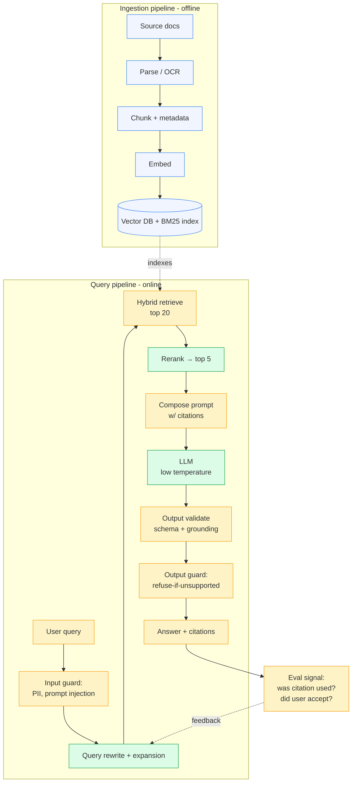

# RAG architecture — naïve vs production

RAG = **Retrieval-Augmented Generation**. The model gets relevant excerpts of your data injected into its prompt before generating, so it can ground its answer in *your* facts instead of its training distribution.

You already understand the retrieval half from [02-embeddings-and-retrieval.md](02-embeddings-and-retrieval.md). This doc shows how retrieval plugs into generation, and what the gap looks like between **demo RAG** (works on stage, embarrassing in production) and **production RAG** (defensible, measurable, debuggable).

---

## Naïve RAG — the version everyone builds first

Five components. Whole thing is ~30 lines of Python. **This is fine for a prototype** and we'll build exactly this in Phase 3.

**Why it doesn't survive production:**
- No way to know if retrieval was good
- No way to know if the model used the retrieved chunks or made up the answer
- Bad queries → bad retrieval → confident wrong answers
- Long retrieved context → "lost in the middle" effect → model ignores the relevant chunk
- No citations, so users (or auditors) can't verify

---

## Production RAG — what gets added

### What each addition buys you

| Component | Problem it solves |
|---|---|
| **Input guard** | Strip PII, detect prompt injection attempts (`"ignore previous instructions..."`) |
| **Query rewrite** | Short/messy queries → richer queries that retrieve better |
| **Hybrid retrieve + rerank** | Recall + precision, as discussed in retrieval doc |
| **Prompt composition w/ citations** | Each chunk is tagged with an ID; system prompt instructs the model to cite which chunks it used |
| **Output validation** | Did the model produce structured JSON? Are the cited chunk IDs ones actually retrieved (not hallucinated citations)? |
| **Output guard** | If the model couldn't ground its answer, refuse rather than guess |
| **Eval signal feedback loop** | Click-through, thumbs-up/down, agent-accepted-suggestion rate — feed back to tune retrieval |

You don't need *all* of this on day one. You add components when **eval** tells you you need them. Which is the next thing to talk about.

---

## RAG evaluation — the discipline that separates senior from junior

If you can't measure your RAG, you can't improve it. Most teams skip eval and ship vibes. Senior interviewers will ask about this specifically.

### Two evals, not one

1. **Retrieval eval (deterministic, fast, cheap)**
   Given a question, did the *correct* chunk(s) end up in the top-k? Metrics: **Recall@k, MRR (mean reciprocal rank), nDCG.**
   - Needs a labeled set: (question, gold chunk IDs).
   - Run on every retrieval change (chunking, embedding model, hybrid weights, reranker tweak).
   - This is the eval that lets you **iterate fast** because it doesn't call an LLM.

2. **Generation eval (LLM-as-judge or human)**
   Given (question, retrieved chunks, generated answer), is the answer **grounded in the chunks** and **answering the question**? Metrics: faithfulness, answer relevance, context relevance.
   - Use **LLM-as-judge** with a strong model (Claude Opus) scoring outputs from a cheaper model (Sonnet/Haiku).
   - Slower and pricier than retrieval eval but catches generation failures.

### Building the eval set — the unglamorous critical work

Get 30–100 real questions from real users (or simulate them with an LLM if you don't have users yet). For each, label which chunk(s) should be retrieved. **You only need to do this once per corpus**, and then every change you make has a number attached to "did this help or hurt?"

> If a candidate tells you "I built a RAG system" but can't tell you their **Recall@5 number**, they don't have a production system, they have a demo.

---

## Common failure modes you should be able to name

| Failure | What happens | Fix |
|---|---|---|
| **Lost in the middle** | Long context, model ignores chunks in middle positions | Smaller top-k, rerank to put best chunks at start/end |
| **Hallucinated citations** | Model invents chunk IDs that weren't retrieved | Validate cited IDs against retrieved IDs; refuse if mismatch |
| **Confidently wrong** | Retrieval missed, model fills the gap from training data | Prompt the model to refuse when chunks don't support the answer; tune retrieval |
| **Stale corpus** | Source docs changed, index didn't | Background re-index job, version stamps in metadata |
| **Wrong domain embedding** | General embedder on niche jargon | Domain-specific embedder, or fine-tune one |
| **Prompt injection via retrieved chunk** | Adversarial text in a doc says "ignore previous instructions" | Treat retrieved text as untrusted: sandwich it between unambiguous delimiters and instruct the model accordingly |

---

## What an interviewer will probe

- **"What does RAG stand for and when would you use it?"** → Retrieval-Augmented Generation. Use it when answers depend on data the model wasn't trained on (private docs, post-cutoff data, domain knowledge) AND the data is too large to fit in context every time.
- **"Walk me through your RAG pipeline."** → use the production diagram above. Even if you only built the naïve version, *know what production adds and why.*
- **"How do you evaluate retrieval quality?"** → labeled question set, Recall@k / MRR / nDCG. Mention LLM-as-judge for generation eval as a follow-up.
- **"What's the difference between fine-tuning and RAG?"** → fine-tuning bakes new behavior/style into the weights (slow, expensive, hard to update); RAG injects facts at inference (fast, cheap, trivially updatable). They solve different problems. *Prefer RAG for facts, consider fine-tuning for style or format.*
- **"How do you handle hallucinations?"** → grounding + citation requirement + output validation that cited chunks actually exist + refuse-when-unsupported prompt + post-hoc faithfulness checks.
- **"How would you build this for JCI's building manuals?"** → ingestion job over PDF manuals (parsing, OCR for scans), structure-aware chunking on section headings, hybrid retrieval (BM25 catches model numbers and error codes — vector catches conceptual queries), MCP tool for live sensor data on top, citations back to the manual section so a technician can verify. **Eval set built from real technician questions.**
