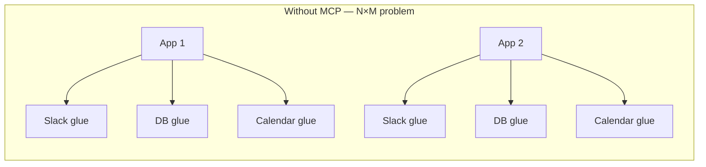
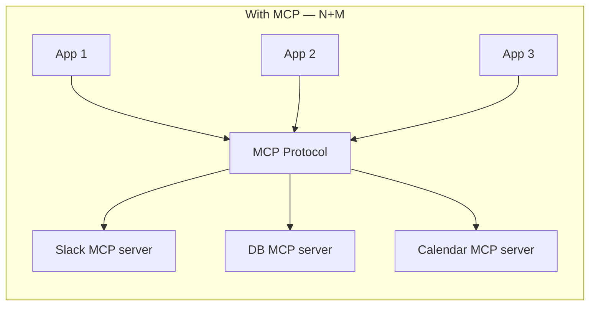
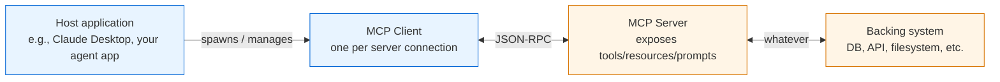
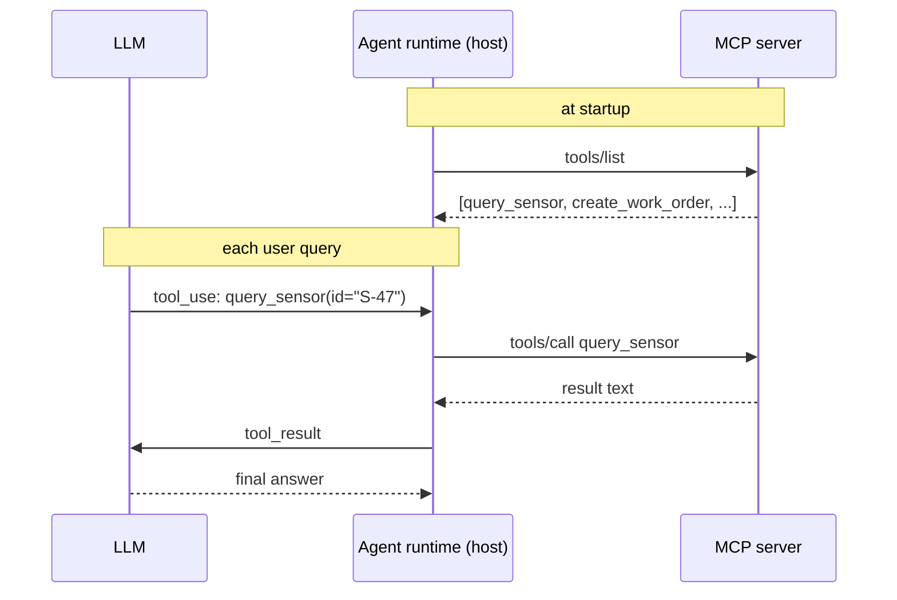

# MCP deep-dive — Model Context Protocol, the actual mechanics

MCP is the part of the AI stack most people wave at without understanding. The depth that pays off is being able to whiteboard the **message lifecycle**, the **three primitives**, and **why MCP exists vs. just calling tools directly** — the mechanics below cover exactly that.

---

## One-line definition

MCP is an **open standard** (introduced by Anthropic, now adopted broadly) that defines how an LLM application (the **host**) connects to external **tools, data sources, and prompts** through a **server** that speaks a specific JSON-RPC protocol over a transport.

Think of it as **"the LSP for AI tools"** — the Language Server Protocol made VSCode, Neovim, and IntelliJ all able to plug into the same Python/TypeScript/Rust language servers. MCP wants to do the same for AI clients ↔ tool providers.

---

## Why MCP exists — the problem it solves

Before MCP, every AI app that wanted to use external tools had to:
- Define its own tool registration format
- Implement its own integration with each data source (Slack, GitHub, your DB, etc.)
- Re-implement tool execution glue in every app

With MCP, **anyone can ship an MCP server** (Slack, your internal HR system, a database) and **any MCP-capable AI client** (Claude Desktop, Cursor, your own app) can connect to it. The same way *any* editor that speaks LSP can use the same Python language server.

### Before vs. after





Concretely: instead of every AI app in an organization re-implementing "talk to the HVAC telemetry service", you'd build **one** telemetry MCP server and any AI app could use it.

---

## Roles in MCP



- **Host** — the AI application (chatbot, agent, IDE). Holds the LLM + user-facing logic.
- **Client** — a library inside the host that manages one connection to one server. A host can have many clients.
- **Server** — a separate process you write that exposes some capability. Can be local (stdio) or remote (HTTP/SSE).

> **Senior detail:** the server is a **separate process**, not a library you import. That's deliberate — it lets servers be written in any language, run with different permissions, and be reused across apps.

---

## The three primitives — what an MCP server can expose

| Primitive | What it is | Who controls it | Example |
|---|---|---|---|
| **Tools** | Functions the model can *call*. Have side effects allowed. | Model-controlled (the LLM decides when) | `create_work_order`, `query_sensor` |
| **Resources** | Read-only data the host/user can attach to context. | Application-controlled (user picks) | `building-manual://section-4.3`, `db://customers/12345` |
| **Prompts** | Pre-canned, parameterized prompts the user can invoke. | User-controlled (user picks from a menu) | `/summarize-incident incident_id=4837` |

Most teams only ship **tools** and miss the resources/prompts story. The distinction worth holding onto is the who-controls-what dimension: name all three primitives *and* who drives each (model / app / user). That's the part most explanations skip.

---

## The wire protocol — JSON-RPC 2.0 over a transport

MCP messages are plain **JSON-RPC 2.0**. Each message is one of: **request** (expects a response), **response** (replies to a request), or **notification** (fire-and-forget).

### Sample initialization handshake

```text
→ client: { "jsonrpc": "2.0", "id": 1, "method": "initialize",
            "params": { "protocolVersion": "2025-06-18", "capabilities": {...}, "clientInfo": {...} } }
← server: { "jsonrpc": "2.0", "id": 1, "result": { "protocolVersion": "2025-06-18", "capabilities": {...}, "serverInfo": {...} } }
→ client: { "jsonrpc": "2.0", "method": "notifications/initialized" }
```

### Then the client asks what's available

```text
→ client: { "jsonrpc": "2.0", "id": 2, "method": "tools/list" }
← server: { "jsonrpc": "2.0", "id": 2, "result": {
            "tools": [
              { "name": "query_sensor", "description": "Read latest reading from a sensor by ID",
                "inputSchema": { "type": "object", "properties": { "sensor_id": {"type": "string"} },
                                 "required": ["sensor_id"] }
              }, ... ]
          } }
```

### When the agent decides to call the tool

```text
→ client: { "jsonrpc": "2.0", "id": 3, "method": "tools/call",
            "params": { "name": "query_sensor", "arguments": { "sensor_id": "S-47" } } }
← server: { "jsonrpc": "2.0", "id": 3, "result": {
            "content": [{ "type": "text", "text": "Sensor S-47: 92.4F at 14:03:11" }],
            "isError": false
          } }
```

**That's the whole protocol shape.** Initialize → discover (`tools/list`, `resources/list`, `prompts/list`) → invoke (`tools/call`, `resources/read`, `prompts/get`). Plus `notifications/*` for things like "the tool list changed."

---

## Transports

The same JSON-RPC messages run over one of:

| Transport | When |
|---|---|
| **stdio** | Local-only. Host spawns server as a subprocess; client writes JSON to server's stdin, reads JSON from stdout. Simplest. What Claude Desktop uses for most servers. |
| **Streamable HTTP** (replaces older HTTP+SSE) | Remote servers. POST for requests, SSE for streaming responses. Used when the server runs on another host. |

The follow-up that often gets missed: "Why stdio at all? Why not always HTTP?" — Because stdio servers can run as plain executables with no network exposure, OS-level permission inheritance, no auth surface area. Perfect for local-only tools (filesystem access, local-DB readers).

---

## How tools flow from MCP server → LLM tool call

This is the part that confuses people. **The LLM doesn't speak MCP.** Your agent runtime is the bridge.



The agent runtime **translates between the LLM's tool-use format and MCP's tools/call format**. So MCP is what the *agent* talks to the world with; the LLM still just emits and consumes tool-use blocks like before.

---

## Why this matters at enterprise scale

A large enterprise has many internal systems (telemetry, work-order systems, building manuals, HR, security, ServiceNow, etc.). The right pattern isn't "build one agent that knows how to talk to all 50 systems." It's:

1. Each system team builds an **MCP server** wrapping their domain (one server, one team's ownership).
2. AI apps (whether built by a central AI team or by product teams) consume those servers as needed.
3. Auth, observability, and rate-limiting live in the server — not duplicated in every consumer.

That framing is exactly what a system-design round is looking for: how AI fits inside a large enterprise without every team reinventing the integration layer.

---

## Questions worth being able to answer

- **"What is MCP?"** → open standard for connecting AI apps to external tools/data via JSON-RPC over stdio or HTTP. Like LSP for AI.
- **"What are the three primitives?"** → tools (model-controlled actions), resources (app-controlled data), prompts (user-controlled templates).
- **"Walk me through a tool call end-to-end."** → handshake (initialize) → discovery (`tools/list`) → LLM emits tool_use → agent runtime translates to `tools/call` → server executes → returns content → agent feeds back to LLM.
- **"Why use MCP instead of just calling APIs directly from the agent?"** → N+M vs N×M integrations, ownership boundary, reusability across AI apps, auth/observability centralization, language-agnostic servers, sandboxable processes.
- **"stdio vs HTTP transport?"** → stdio = local, simple, OS-permission-scoped. HTTP = remote, needed when servers run separately or are shared across hosts.
- **"What does the LLM actually see of MCP?"** → nothing directly. It sees a list of tools (name + description + JSON schema) and emits tool_use blocks. The host's MCP client is the bridge.
- **"How would you architect MCP at enterprise scale?"** → one server per domain (telemetry, work-orders, manuals, asset registry), owned by the team that owns the system. AI apps consume the servers. Auth and observability in the servers, not in every consumer.
