# Observability for AI apps — the part that separates demos from production

If your AI app doesn't have observability, you don't have a production system — you have a black box that occasionally gets a complaint. This is the doc where classic distributed-systems observability (Splunk + Dynatrace + SLOs) **directly translates** into AI-engineering depth.

---

## Why AI observability is *harder* than regular service observability

A normal microservice has well-defined inputs and outputs. You log the request, you log the response, you measure latency. Done.

An AI app's "request" produces:
- A **non-deterministic** output (same input ≠ same output)
- An output whose **correctness can't be checked by code** in most cases
- A **trajectory** (which tools were called, in what order, with what args) that may differ between runs of the same query
- **Retrieved context** (which RAG chunks) that affected the answer but isn't in the LLM call itself

So "200 OK + 800ms latency" tells you almost nothing about whether the system is healthy. You need to log the **whole thinking process**, not just the request/response.

---

## The three pillars, re-skinned for AI

| Pillar | Regular service | AI app |
|---|---|---|
| **Logs** | Request payload, response, errors | Full message history, tool calls + results, retrieved chunks + IDs, model version, prompt template version, sampling params |
| **Metrics** | RPS, p50/p99 latency, error rate, CPU | All of those + token usage (input/output/total), cost per request, cache hit rate, retrieval Recall@k, tool error rate, agent loop iterations, "refused to answer" rate |
| **Traces** | One span per service hop | One span per LLM call, one span per tool call, one span per retrieval — parent-child structured so you can replay the whole trajectory |

---

## OpenTelemetry semantic conventions for GenAI

OTel (the same open standard behind backends like Dynatrace) has **GenAI semantic conventions** — a standard set of span attributes for AI workloads, so your traces are consistent across vendors. Examples of attributes:

| Attribute | Example |
|---|---|
| `gen_ai.system` | `anthropic` |
| `gen_ai.request.model` | `claude-sonnet-4-6` |
| `gen_ai.request.temperature` | `0.2` |
| `gen_ai.usage.input_tokens` | `1842` |
| `gen_ai.usage.output_tokens` | `512` |
| `gen_ai.operation.name` | `chat` / `tool_call` / `embedding` |

Using "OTel GenAI semconv" correctly is a quick tell that someone has actually instrumented an AI system, not just read about it.

---

## What to trace — a typical agent run

```mermaid
gantt
    title Agent trace — "Why is sensor 47 high?"
    dateFormat X
    axisFormat %L
    section trace
    HTTP /chat (root)            :a, 0, 4200ms
    section retrieval
    embed query                   :b, 50, 80ms
    vector search                 :c, 130, 60ms
    rerank                        :d, 200, 220ms
    section LLM 1
    anthropic.messages.create     :e, 450, 1100ms
    section tool 1
    mcp: query_sensor             :f, 1580, 180ms
    section LLM 2
    anthropic.messages.create     :g, 1780, 900ms
    section tool 2
    mcp: search_manual            :h, 2710, 320ms
    section LLM 3
    anthropic.messages.create     :i, 3050, 1150ms
```

You should be able to pull up *any* user query in your trace backend, see the whole tree, and answer:
- How many tokens? How much $?
- Which retrieval chunks were used?
- Which tools were called? Did any fail?
- How long did each piece take?
- Which prompt template version was active?

---

## What to *measure* — the metrics that matter

### Cost & throughput
- **Tokens per request** (p50, p95, p99) — input, output, total separately
- **$ per request** (p50, p95, p99) — the metric your finance team will eventually ask for
- **Prompt cache hit rate** — Anthropic and OpenAI both support prompt caching now; this should be high for repeated system prompts. Low cache rate = wasted money.
- **Requests per second** + queue depth

### Quality
- **Refusal rate** — model says "I can't help with that". Sudden spike = something changed upstream.
- **Tool error rate** per tool — high error rate on one tool either means broken tool or model is calling it wrong
- **Retrieval miss rate** — % of queries where the model fell back to "I don't have enough information"
- **Agent loop iterations** distribution — most should be 1–3; long tails are debugging gold
- **User feedback signal** — thumbs up/down, accepted-suggestion rate

### Drift
- **Output schema validation failure rate** — model returned malformed structured output
- **Citation validity rate** — % of citations that point to chunks actually retrieved (catches hallucinated citations)

---

## Eval-in-production — the discipline that beats "ship and pray"

You should have **two layers of eval**:

1. **Offline eval suite** — runs in CI on every prompt/model/RAG change. Labeled question set, Recall@k, LLM-as-judge faithfulness. No surprises in prod.
2. **Online eval / monitoring** — sampling of prod traffic, run an LLM-as-judge faithfulness check, alert when the score drops below a threshold.

The online eval is the AI equivalent of a classic SLO practice — you define SLOs that map to user-visible behavior; for AI, the user-visible behavior is "the answer was grounded and helpful," and you measure it the same way.

---

## Safety + audit logging — the under-talked part

For an enterprise, every LLM interaction probably needs to be **audit-logged** for compliance:

- Full prompt + full response, retrievable by user ID + timestamp
- Tool calls + their actual return values
- Model version + prompt template version (so you can answer "what was the system telling users last Tuesday")
- PII handling — was anything redacted before going to the model? Verifiable.

This isn't optional in healthcare-adjacent or regulated industries. Smart-buildings has some of this too (anything touching safety-critical building systems).

---

## Tooling — what you'd actually use

| Layer | Tools |
|---|---|
| **OTel instrumentation** | `opentelemetry-instrumentation-anthropic`, `opentelemetry-instrumentation-openai` (auto-trace SDK calls) |
| **Trace + metric backend** | Dynatrace, Datadog, Honeycomb, Grafana Tempo, Phoenix (open) |
| **LLM-specific observability** | Langfuse, Phoenix (Arize), Helicone, LangSmith — these add UI for prompt/trace inspection and eval |
| **Eval frameworks** | Promptfoo, DeepEval, Inspect (UK AISI's), or hand-rolled w/ Pytest |

For Phase 4 of this lab, we'll wire up **OpenTelemetry + Phoenix** locally — that gets you live trace visualization for the capstone agent.

---

## Questions worth being able to answer

- **"How would you monitor an LLM app in production?"** → the three pillars re-skinned for AI: structured logs of the trajectory, metrics on tokens/cost/quality/drift, OTel traces of the full request tree. Mention OTel GenAI semantic conventions.
- **"How do you know your AI is still working?"** → offline eval in CI for changes + online sampling eval with LLM-as-judge + watching refusal/citation-validity drift.
- **"What's prompt caching and why does it matter?"** → Anthropic and OpenAI both cache identical prompt prefixes; cache hits cost ~10% of fresh tokens. For agents with stable system prompts + tool schemas, cache hit rate should be >70% or you're burning money.
- **"How do you audit an AI app?"** → full prompt+response logging keyed by user+timestamp+model version+prompt version, tool call ledger, redaction proof for PII.
- **"Your AI app's quality dropped overnight — how do you debug?"** → check whether a model version changed, whether a prompt version changed, whether retrieval quality (Recall@k) dropped, whether refusal rate spiked, replay traces from before vs. after.
- **"How does classic observability experience translate to AI?"** → SLOs that map to user-visible behavior, distributed tracing across services, alert on regression *before* users feel it. Same playbook, AI-specific signals.
