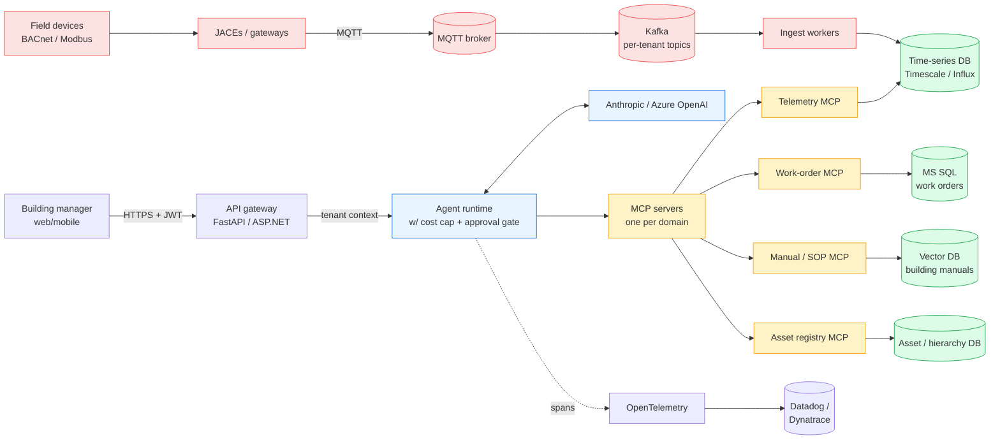
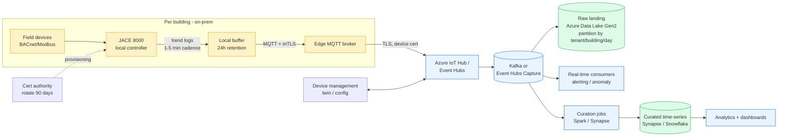
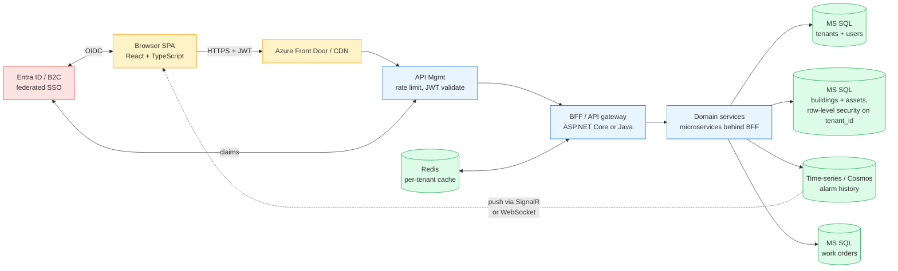

# System design rounds

Three prompts you're likely to get in a senior interview. Each one mixes a different ratio of AI / distributed systems / full-stack web — matching the JCI JD's actual breadth.

For each prompt:
- **The shape of your answer** — the order to attack it in
- **Whiteboard sketch** as Mermaid
- **What to lead with** (the first 60 seconds set the tone)
- **Hard questions you'll get back** — and what to say

---

## The shape of every system-design answer (rehearse this skeleton)

```
1. Clarify  (60s) → what's actually being asked, what's in scope, what's out
2. Constraints (30s) → scale (RPS, users, data volume), latency targets, SLOs
3. High-level diagram (3 min) → boxes and arrows on the board
4. Walk one happy path  (2 min) → trace a request end-to-end
5. Pick 1-2 components to deep-dive (5+ min) → this is the senior round
6. Failure modes  → what breaks, how you detect, how you recover
7. Trade-offs you'd make differently at smaller / larger scale
```

**Common mistake:** candidates jump straight to step 3 (boxes). Skip steps 1-2 and you build the wrong thing fast. **Always clarify first.** Even if the question seems obvious.

---

## Prompt 1 — AI Copilot for a Building Manager Handling 50K Sensors

> *"Design an AI copilot that a building manager can use to ask natural-language questions about their portfolio — current telemetry, fault history, recommended actions — for ~50K sensors across 200 buildings."*

### Clarify first

- Real-time or recent-data acceptable? (Probably recent: 1-min staleness OK for chat-driven ops)
- How many concurrent users? (Tens, maybe ~100 globally — not Twitter scale)
- What's the data we have access to? (Sensor telemetry, fault logs, building manuals, work-order history)
- Can the copilot *take actions*, or only inform? (Critical — if it can actuate, you need approvals)
- Multi-tenant? (Yes — JCI customers shouldn't see each other's data)

### Whiteboard



### Lead with this 60-second pitch

> *"I'd separate this into three layers. First, an event-driven telemetry tier — sensors → MQTT broker → Kafka → ingest workers → time-series store. The AI doesn't talk to field devices directly; it queries the derived store. Second, an MCP-server-per-domain layer — one team owns telemetry, another owns work orders, another owns manuals — so the AI app can compose them but doesn't take on integration ownership. Third, an agent gateway with cost caps, approval gates on side-effecting tools, and OpenTelemetry tracing. Same DNA I built at Kaiser for the Data eXchange Platform, applied to building telemetry."*

That answer is **exactly the capstone you built**. Just say it.

### Deep-dive options (pick one when they ask "tell me more about X")

- **RAG over manuals** — chunking, hybrid retrieval, eval. You have the lab numbers.
- **Multi-tenancy** — per-tenant Kafka topics + row-level security in the time-series store. Tenant ID in every span. Per-tenant rate limits at the gateway.
- **Approval gate** — server-side session state, suspend the agent loop on side-effecting tool intent, resume on user click. *Note this is the production version of the simpler pattern in the lab.*

### Hard questions you'll get back

| Q | A |
|---|---|
| "What if a customer asks something the AI gets wrong?" | Grounded prompting + citation requirement + refuse-when-unsupported. Audit log every Q+A. Online LLM-as-judge sampling for drift. Human-in-the-loop for any action. |
| "How do you keep cost predictable across 200 buildings?" | Per-tenant rate limit + per-request cost cap (in the lab already). Prompt caching on system + tool schemas. Smaller model (Haiku) for routine queries, bigger model (Opus) only when escalated. |
| "What if a single building generates 10x normal telemetry?" | Kafka partition key = sensor ID, so spikes spread. Ingest workers autoscale on consumer lag (KEDA). Time-series DB has built-in TTL + compression. |
| "How would you ramp on new buildings?" | New buildings publish to existing topics, asset registry adds their hierarchy, manuals get ingested via the existing pipeline. No code changes for typical onboards. |

---

## Prompt 2 — BMS-to-Cloud Telemetry Pipeline (no AI)

> *"Design the pipeline that takes sensor data from JCI's on-prem building controllers (Niagara JACEs) and gets it to a cloud analytics platform reliably, at scale, across 10K buildings."*

This prompt is **pure distributed systems** — your home turf. No AI at all. Demonstrates the JD's "integrating web-based apps with multiple IaaS/PaaS/SaaS components" requirement.

### Clarify first

- What does "reliably" mean? (P99 latency, max acceptable data loss in seconds, durability target)
- One cloud or multiple? (Likely Azure given JCI is Azure-shop)
- Compliance constraints? (Building data might be subject to local regulations — e.g., EU buildings need EU regions)
- How many points per building? (JACE typically aggregates ~1000-5000 points)
- Polling vs change-on-event? (Both — periodic trend logs + immediate alarms)

### Whiteboard



### Lead with this

> *"Three principles. One — buffer at the edge. JACEs hold 24 hours of trend logs locally so a broker outage doesn't lose data. Two — Kafka or Event Hubs is the single fan-out point in the cloud; raw to a landing zone in Data Lake Gen2, real-time consumers for alarms, curation jobs for analytics. Three — device identity matters. mTLS with per-device certs rotated every 90 days, twin-based config management so I can target a config push to one building without redeploying anything."*

### Deep-dive options

- **Schema evolution** — Avro / Protobuf with schema registry. Versioned. JACEs send schema version with payload.
- **Idempotency** — `(building_id, point_id, timestamp)` is the natural key. Upsert in the time-series store.
- **Partitioning** — Kafka partition key = `building_id` so per-building order is preserved + ingest workers scale horizontally without cross-building consistency requirements.
- **Backfill / replay** — Event Hubs has Capture which lands raw to ADLS; you can re-process from there for new analytics jobs. Avoid having to re-poll JACEs.

### Hard questions

| Q | A |
|---|---|
| "What if the cloud goes down for 12 hours?" | Edge buffer holds 24h. Producer retries with backoff. Alert fires at 4h of buffered backlog so the team gets ahead of the 24h limit. |
| "How do you onboard 1000 buildings without manual setup?" | Device Provisioning Service — devices auto-enroll using a group enrollment key + per-device unique cert at first boot. Asset registry pulls in once enrolled. |
| "How do you handle a noisy / faulty sensor producing junk?" | Validation at ingest (range check, rate check). Tag bad readings with `quality=bad`, don't drop — analytics decides whether to filter. Alerting fires on persistent bad-quality from one device. |
| "What about a customer who wants their data in their own region?" | Multi-region IoT Hub deployment, routing based on tenant region claim. Storage stays in-region. Cross-region only for aggregated, anonymized analytics. |

---

## Prompt 3 — Multi-Tenant Customer-Facing Dashboard for JCI Customers

> *"Design a customer-facing web dashboard where JCI customers (building operators) can view their own buildings, drill into alarms, and create work orders. Multi-tenant, real-time-ish, runs on Azure."*

This prompt is **full-stack web + multi-tenancy** — covers React, ASP.NET / Java, MS SQL, Azure, the whole JD breadth. No AI mentioned but you can offer to add it as a follow-up.

### Clarify first

- How many tenants? Buildings per tenant? (Tens to hundreds of customers, each with 1-50 buildings)
- Auth model? (B2B — customer admins manage their own users, federated SSO)
- Real-time updates? (Push when alarms fire is non-negotiable; for telemetry "near-real-time" via polling or SSE is fine)
- Mobile? (Yes — responsive web first, native if there's appetite later)

### Whiteboard



### Lead with this

> *"Three architectural choices. One — BFF pattern: a single API surface tailored to the dashboard, fans out to domain microservices behind it. Frontend doesn't talk to 10 services directly. Two — multi-tenancy via row-level security on every domain table, with tenant_id in the JWT enforced at the BFF, not trusted from the client. Three — push for alarms via SignalR over WebSocket; polling for normal telemetry refreshes. SSO via Entra ID with B2B federation so customers' admins manage their own users."*

### Deep-dive options

- **Row-level security pattern in MS SQL** — `CREATE SECURITY POLICY` with predicates on tenant_id. Every query auto-filtered. Defense in depth alongside app-level checks.
- **Per-tenant rate limiting** — APIM policy keyed on tenant claim. Plan-based tiers (basic / pro / enterprise).
- **React state management** — server state via React Query (TanStack Query), UI state via local component state or Zustand for cross-page. Don't reach for Redux unless there's real cross-feature state complexity.
- **Real-time without state hell** — SignalR pushes events; client invalidates React Query caches; UI re-fetches the canonical state. Avoids "frontend state out of sync with server" bugs.

### Hard questions

| Q | A |
|---|---|
| "What if tenant A's noisy traffic affects tenant B's latency?" | Per-tenant rate limits at APIM. Per-tenant connection pool limits at the BFF. Query timeouts. Async / fire-and-forget for non-critical writes. |
| "How do you do feature flags across tenants?" | Feature flag service (LaunchDarkly / open-source equivalent) keyed on tenant + user attributes. Plan-tier rollouts. Default-off for risky features. |
| "How do you migrate the schema for one tenant without breaking others?" | Don't. Schema is shared. Migrations are additive (new optional columns), tested in stage with prod-shaped data, deployed atomically with backward-compatible app code. Big bangs are forbidden. |
| "Where does the AI assistant from Prompt 1 plug in?" | New service behind the BFF. Tenant context propagated end-to-end so the assistant only sees that tenant's MCP-server-discovered data. Approval gates the same way as Prompt 1. |

---

## Cross-cutting advice for ALL system-design rounds

- **Always draw the boxes.** Even if it's a Zoom interview — Excalidraw or just describe positions verbally. Visualizing earns more credit than perfect verbal descriptions.
- **Name your storage choices specifically.** "A database" is junior. "Postgres for transactional, Timescale for time-series, MS SQL where the JCI stack already lives" is senior.
- **Use the word "trade-off" out loud at least 3 times.** Senior interviewers are looking for evidence you don't believe in silver bullets.
- **If you don't know something — say so.** "I'd need to look up X" beats "uh, yeah, I think it's..." every time. You earn trust by being honest about edges.
- **End with what you'd do differently at 10x scale.** "Today this is fine; at 10x I'd partition tenants across regions / shards / etc." That last beat lands you the senior level.

---

## How to drill these

- **Two days before:** read through all three prompts. Practice the 60-second lead aloud for each.
- **Day before:** pick one prompt and *draw the whiteboard from memory on paper*. Time yourself — should take 5 min to get to a defensible diagram.
- **Day of:** don't draw anything new. You've got three rehearsed patterns; one of them will fit whatever they ask.
