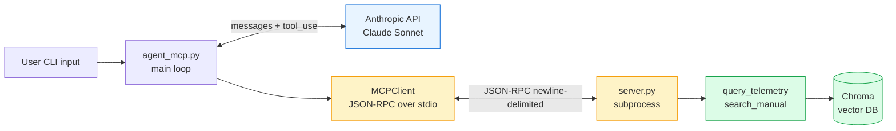

# 3.5 — Hand-rolled MCP server (and an agent that uses it)

This is the build that turns "I know what MCP is" into "I've implemented MCP."

```
mcp/
├── server.py         # raw JSON-RPC over stdio — ~150 lines of actual protocol
├── client_demo.py    # walks the protocol without an LLM — see the wire
├── agent_mcp.py      # the Phase 3.4 agent, but tools live in an MCP subprocess
└── README.md         # this file
```

## Why do this by hand when an MCP SDK exists?

The official `mcp` Python SDK is what you'd ship in production — it handles transports, validation, capability negotiation, retries. **For this lab the SDK is exactly what we don't want**, because it abstracts away the thing we're trying to learn: the wire protocol.

After you've written `server.py` once by hand, the SDK becomes obvious — it's just an ergonomic wrapper around the same JSON-RPC mechanic you now understand from the inside.

## Run order

```bash
# 1) protocol walk-through — no LLM. See every message in both directions.
uv run python src/03-agent/mcp/client_demo.py

# 2) the agent, but tools come via MCP instead of in-process imports
uv run python src/03-agent/mcp/agent_mcp.py
uv run python src/03-agent/mcp/agent_mcp.py "What does fault E12 mean?"
```

Make sure `data/chroma/` exists (i.e. you ran Phase 3.2's `01_ingest.py` once). The `search_manual` tool reuses that vector store.

## What `client_demo.py` shows you

You'll see, color-coded, every message in both directions:

```
→ SEND       { initialize request }
← RECV       { server capabilities }
→ SEND       { notifications/initialized — no response }
→ SEND       { tools/list }
← RECV       { tool catalog with inputSchema (camelCase!) }
→ SEND       { tools/call query_telemetry }
← RECV       { content: [{type: "text", text: "..."}], isError: false }
→ SEND       { tools/call nope_does_not_exist }
← RECV       { content: [{type: "text", text: "ERROR..."}], isError: true }   ← note: NOT a JSON-RPC error
```

That last point is the **most-missed nuance in MCP**:

- **JSON-RPC error** (`response.error`) — for *protocol* failures: unknown method, malformed request, server bug.
- **Tool error** (`response.result.isError = true`) — for *application* failures: bad arg, tool raised, downstream timeout.

Mixing them up is a classic junior MCP-server bug. JSON-RPC errors stop the client cold; tool errors are data the agent can react to.

## What `agent_mcp.py` shows you

Structurally identical to `src/03-agent/agent.py` — same loop, same model, same trace format. But:

- Tools come from `mcp.list_tools()` instead of an in-process Python import.
- Tool execution is `mcp.call_tool(name, args)` — i.e., a JSON-RPC request over the server's stdin.
- The agent runtime translates Anthropic's `tool_use` blocks into MCP `tools/call` requests, and translates MCP `content` responses back into Anthropic's `tool_result` blocks.

**This is the production architecture.** Every tool lives in a separate process (potentially a different team's repo, a different language, with its own auth) — and the agent just speaks MCP to all of them. Compare to `agent.py` where tools were imported as Python functions and ran in the same process.

## The two spec gotchas you should mention unprompted in an interview

### 1. stdout is sacred

The server MUST NOT write anything to stdout that isn't a JSON-RPC message. A stray `print("hello")` will corrupt the protocol and the client will reject the next message. **All logging goes to stderr.** Look at `log()` in `server.py` — it goes to `sys.stderr`, never stdout.

### 2. Schema field name mismatch

| Spec | Field |
|---|---|
| MCP `tools/list` response | `inputSchema` (camelCase) |
| Anthropic Messages API `tools` param | `input_schema` (snake_case) |

Same JSON Schema content, different field name. The agent runtime does the translation — see `mcp_to_anthropic()` in `agent_mcp.py`. This kind of impedance is the unsexy plumbing of integration that interviewers reward you for knowing about, because it means you've actually wired both ends.

## Architecture diagram of what you just built



## Tying this back to interviews

You can now legitimately say:

> "I implemented an MCP server from raw JSON-RPC — handshake, tools/list, tools/call — and wired an agent client that translates between Anthropic's tool_use format and MCP's tools/call format. The agent doesn't import tools as Python functions; it talks to them via stdio JSON-RPC the same way it would talk to a Slack or DB MCP server. Repo's public."

Three follow-up things to volunteer if they keep probing:

1. **The three MCP primitives** (tools / resources / prompts) and who controls each (model / app / user). We only implemented tools because that's the agent-relevant primitive; resources and prompts are user-controlled and out of scope for this lab.
2. **Stdio vs HTTP transport.** We used stdio because it's local-only, OS-permission-scoped, and zero auth surface area. Production multi-team MCP servers usually run as HTTP/SSE so multiple agents can connect.
3. **The architectural payoff at JCI scale:** one MCP server per domain (telemetry, work orders, asset registry, building manuals), owned by the team that owns the system. AI apps consume the servers. Auth and observability live in the server, not duplicated in every consumer.
