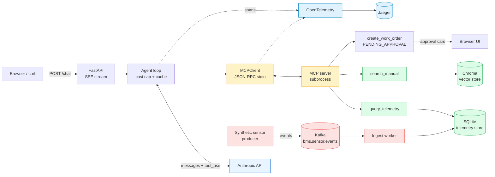

# Phase 4 capstone — Building Ops Assistant

Production-shaped AI agent for HVAC/BMS operations. Same conceptual stack as everything else in this repo, but **wrapped in a FastAPI gateway, instrumented with OpenTelemetry, containerized, and viewable in Jaeger**.

Build progress:

- **4a — done:** FastAPI + agent + MCP integration + OTel tracing + Docker
- **4b — done:** HTML/JS chat UI, prompt caching, per-request cost cap, `create_work_order` tool w/ approval gate
- **4c — done:** Kafka + synthetic sensor producer + ingest worker → SQLite telemetry store; `query_telemetry` reads from the store

**Phase 4 is complete.** The architecture diagram below is now the running system.

## Architecture (session 4a)



## Files

```
src/04-capstone/
├── app/
│   ├── __init__.py        ← makes app/ a Python package
│   ├── main.py            ← FastAPI: /chat (SSE), /tools, /health, /approvals, / (UI)
│   ├── agent.py           ← agent loop w/ OTel spans + prompt cache + cost cap
│   ├── mcp_client.py      ← MCP client w/ per-call spans
│   ├── pricing.py         ← per-token USD pricing table (single source of truth)
│   └── telemetry.py       ← OTel setup; falls back to console exporter
├── frontend/
│   └── index.html         ← single-file chat UI w/ SSE + inline approval cards
├── kafka/                 ← Phase 4c
│   ├── store.py           ← SQLite "time-series-like" store, schema + helpers
│   ├── producer.py        ← synthetic sensor event generator
│   └── consumer.py        ← ingest worker (Kafka → SQLite)
├── docker/
│   ├── Dockerfile         ← multi-stage, uv-based, pre-warms embedder + ingests corpus
│   └── docker-compose.yml ← api + jaeger + kafka + producer + ingest + shared volume
└── README.md
```

## Session 4b additions — what each one buys you

### Prompt caching

The system prompt and tool schemas are stable across all requests. We mark the last block of each with `cache_control: {type: "ephemeral"}`. After the first request, Anthropic returns those tokens as `cache_read_input_tokens` at ~10% of the fresh-input price. **Cache hit rate should be >70%** for any agent with a stable surface. In the UI's usage pill bar you'll see `cache read: N`, and the `gen_ai.usage.cache_read_input_tokens` span attribute lets you alert on regressions.

### Per-request cost cap (`COST_CAP_USD`)

Hard ceiling. Agent computes cumulative USD across iterations using `pricing.py`. If a single user request exceeds the cap, agent yields a structured `error` event and aborts cleanly — the UI shows it, no zombie loops, no surprise bills. Default `$0.50/request`; override in env.

### `create_work_order` tool + approval gate

A new MCP tool that is **deliberately side-effecting** — and so deliberately gated. The tool returns `{"status": "PENDING_APPROVAL", "approval_id": "...", "proposed_work_order": {...}}` instead of executing. The agent's system prompt teaches it to surface this to the user. The frontend renders an inline card with Approve/Deny buttons; clicking either POSTs to `/approvals/{approval_id}` which logs the decision.

**Honest caveat (also in main.py):** A real prod approval gate uses session state — the server holds the half-finished agent loop, surfaces the proposed action, and resumes the loop on approve. We did the pedagogically equivalent stateless version so the architectural lesson lands without an async refactor. Mention this distinction in interviews; it shows you know what real prod looks like.

## Session 4c additions — the event-driven half

### Kafka + producer + ingest worker

Adds three docker-compose services:

- **`kafka`** — single-broker Bitnami image, KRaft mode (no Zookeeper).
- **`producer`** — writes synthetic sensor events to `bms.sensor.events` every 5s for 5 sensors. `S-47` runs deliberately hot (~88°F) so the "alarming sensor" demo is reproducible.
- **`ingest`** — consumes the topic and writes each event to a SQLite table mounted on the shared `telemetry-data` volume.

The `query_telemetry` tool now **reads from SQLite first**, falling back to the deterministic hash mock if the store is empty or missing. This means:

- Standalone Phase 3 agent **still works** with no Kafka at all (mock data).
- Full Phase 4 stack returns **real time-series data** to the agent.

### Why bother with Kafka at all in a demo?

Because **the same shape is the only sane way to build a real building-ops AI system at scale**. A building has thousands of sensors emitting data continuously. You don't have the agent poll a JACE directly — you have:

1. Field devices → Kafka topic (single ingest point per site)
2. Topic → multiple independent consumers: a time-series store for queries, an alerting service, an AI inference service, an archive for compliance
3. AI agent reads from the **derived store**, never directly from devices

This is structurally the **same architecture** as Kushal's Kaiser DXP — Kafka decoupling 12+ services. Translating the story into JCI's domain: "I'd put HVAC sensor telemetry on Kafka, fan it out to a time-series tier the AI assistant queries, an alerting tier ops uses, and a compliance archive — same DNA as my Kaiser work, applied to building data." That's the interview bridge.

## Run the full stack

```bash
cd src/04-capstone/docker
docker compose up --build
```

First build is slow (~3-5 min: python image, deps, embedder, corpus ingest). Subsequent starts: ~15s.

| Endpoint | Purpose |
|---|---|
| http://localhost:8000 | The chat UI |
| http://localhost:16686 | Jaeger trace UI (service `building-ops-assistant`) |
| `docker compose logs -f producer` | Watch sensor events flow |
| `docker compose logs -f ingest` | Watch events land in SQLite |

In the chat UI, try **"check sensor S-47"** — the response should show `source: telemetry-store` in the tool result (not `source: mock`), and the reading should be ~88°F because the producer biases S-47 hot. The agent will likely chain into `search_manual` and find the high-temperature fault explanation.

## Closing notes

All the architectural decisions you can defend in an interview:

1. **MCP server as subprocess** — simple for the demo. Prod = separate HTTP/SSE service per domain.
2. **SQLite as telemetry store** — pattern is the point. Prod = Timescale / InfluxDB / cloud warehouse.
3. **Stateless approval gate** — pedagogical. Prod = session-state pause/resume.
4. **Pure-Python `kafka-python-ng`** — zero install friction. Prod throughput = `confluent-kafka` with librdkafka.
5. **Single Kafka broker, KRaft mode** — demo-only. Prod = 3+ broker cluster with proper replication.

Every one of these caveats is a senior signal when you bring them up unprompted.

## Run it — two ways

### Option A — local dev (fastest iteration)

```bash
# from repo root
# spans will print to your stdout (console exporter), no Jaeger needed
cd src/04-capstone
uv run uvicorn app.main:app --reload --host 0.0.0.0 --port 8000
```

Then in another terminal:

```bash
curl -N -X POST http://localhost:8000/chat \
  -H "Content-Type: application/json" \
  -d '{"query":"What does fault E12 mean?"}'
```

You'll get a stream of `data: {...}\n\n` Server-Sent Events — `tool_call`, `tool_result`, `final`, `usage`. That's the agent's trajectory leaking out as it runs.

### Option B — docker-compose with Jaeger (the demo-worthy way)

```bash
# from repo root
cd src/04-capstone/docker
docker compose up --build
```

Then:

- **API:** http://localhost:8000/health
- **Jaeger UI:** http://localhost:16686

Hit the API once with `curl`, then open Jaeger, pick service `building-ops-assistant`, and **see your agent run as a trace tree**:

```
agent.run                       (2.4s)
├─ agent.iter[0]                (1.1s)
│  ├─ gen_ai.chat               (900ms)   ← attrs: model, tokens, stop_reason
│  ├─ mcp.tool.query_telemetry  (15ms)
│  └─ mcp.tool.search_manual    (180ms)
├─ agent.iter[1]                (1.2s)
│  └─ gen_ai.chat               (1.2s)
```

**That trace is the artifact you put in the interview.** Screenshot it for the top-level README in session 4c.

## OTel attribute conventions

Following the OTel [GenAI semantic conventions](https://opentelemetry.io/docs/specs/semconv/gen-ai/) so any compliant backend (Jaeger, Datadog, Honeycomb, Phoenix) renders the right fields:

| Span | Attributes |
|---|---|
| `gen_ai.chat` | `gen_ai.system`, `gen_ai.request.model`, `gen_ai.request.temperature`, `gen_ai.usage.input_tokens`, `gen_ai.usage.output_tokens`, `gen_ai.response.stop_reason` |
| `mcp.tool.<name>` | `mcp.tool.name`, `mcp.tool.arguments`, `mcp.tool.is_error` |
| `agent.run` | `agent.model`, `agent.iterations`, `agent.tokens.input`, `agent.tokens.output` |

## Architectural decisions for this session, with reasoning

| Decision | Why | What we'd do differently in real prod |
|---|---|---|
| MCP server runs as **subprocess inside the API container** | Simplicity — one container to deploy, stdio transport works as-is | Run MCP servers as separate services over HTTP/SSE, owned by domain teams |
| **All-in-one Jaeger** for the trace backend | Zero-config local demo | OTel Collector → managed backend (Datadog / Honeycomb / Dynatrace) |
| **Ingest at Docker build time** | Container is self-contained — no "did you remember to run ingest?" | Ingest is its own job, vector DB is shared across replicas |
| **SSE for `/chat`** | Lets the UI render tool-call progress as the agent runs | WebSocket if you need bidirectional later |
| No auth | Lab scope | OIDC / bearer token, per-user rate limits, audit log per call |

## What you can now legitimately claim

> "I built a FastAPI agent gateway with an SSE-streaming `/chat` endpoint, instrumented with OpenTelemetry using the GenAI semantic conventions — every LLM call and every MCP tool call is a span, viewable in Jaeger. MCP server runs as a subprocess (would be a separate service in real prod). Whole thing is containerized and runs in docker-compose. Repo's public."

That sentence answers six interview questions at once — API design, agent loop, MCP integration, observability, deployment, and the candor of "what I'd do differently in real prod."
